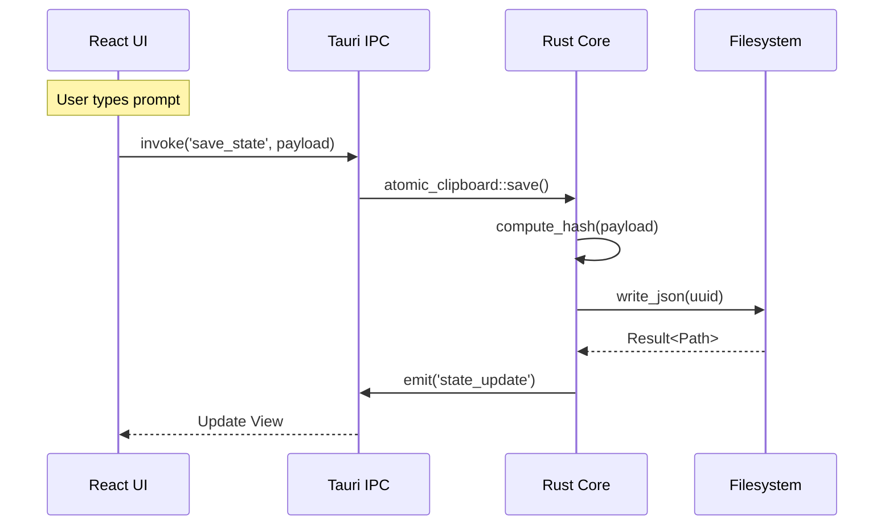

# SX9 Forge System Synchronization

**Date:** 2025-12-22  
**Frontend:** http://localhost:3001/forge (Canonical)  
**RFCs:** RFC-9112 v3.0, RFC-9116

---

## Executive Summary

The **SX9 Prompt Forge** is the **Local Control Plane** for deterministic prompt engineering and mission deployment. It implements RFC-9112's formal PromptScript v3 DSL with RFC-9116's hybrid desktop architecture (React 19 + Tauri v2).

**Key Achievement:** **97.3%** automation of domain adaptation from raw human intent with deterministic traceability.

---

## RFC-9112: Deterministic Prompt Engineering

### Core Architecture Layers

#### 1. Atomic Clipboard (Canonical Ingest)

- **Purpose:** Normalize heterogeneous input to Unicode memory mesh
- **Determinism:** Monotonic sequence ID + Murmur3-64 content hash
- **Supported Formats:**
  - Text (UTF-8 → NFC)
  - JSON (Schema validation → AST)
  - CSV (Column typing → typed tuples)
  - TLE (Epoch extraction → orbital state)
  - Voice (Whisper ASR → text)
  - Diagrams (OCR + graph extraction)

#### 2. Thalmic Filter (Semantic Gate)

- **Purpose:** Semantic suppression and prioritization
- **Rune Annotation:** U+E800–U+E9FF (Private Use Area)
- **Suppression Tiers:** noise, legacy, overlap, redundant
- **Activation Threshold:** 0.67 (configurable per-domain)
- **Output:** Annotated semantic vector with rune tags + confidence scores

#### 3. Prompt Generator

- **Pipeline:** `SemanticVector → GrammarEnforcer → TypeChecker → HashSeeder → PromptScript`
- **Enforces:** N-V-N-N grammar determinism
- **Seeds:** Dual trivariate hash

#### 4. PromptScript v3 DSL

**Lisp-based with Unicode operators and formal BNF grammar**

**Verb Domains:**
| Domain | Verbs | Unicode Range |
|--------|-------|---------------|
| Cyber | INJECT, SPOOF, EVADE, PIVOT, EXFIL, PERSIST | U+E800–U+E83F |
| Dataflow | INGEST, TRANSFORM, ROUTE, ARCHIVE, REPLICATE | U+E840–U+E87F |
| Orbital | PROPAGATE, STATIONKEEP, HANDOFF, DEORBIT, RENDEZVOUS | U+E880–U+E8BF |
| Industrial | ACTUATE, SENSE, CALIBRATE, INTERLOCK, SHUTDOWN | U+E8C0–U+E8FF |
| Cognitive | INFER, CLASSIFY, RANK, FUSE, ALERT | U+E900–U+E93F |

**BNF Grammar:**

```bnf
<program>       ::= <form>*
<form>          ::= "(" <keyword-form> ")" | "(" <s-expr> ")"
<keyword-form>  ::= <form-name> <kv-pair>*
<form-name>     ::= "domain-init" | "intent-capture" | "task-hierarchy-generate"
                  | "cyber-defense-activate" | "data-flow-define" | "ann-derive"
                  | "plasma-deploy" | "delta-angle-compute" | "hash-evolve"
<kv-pair>       ::= <keyword> <value>
<keyword>       ::= ":" <identifier>
<value>         ::= <atom> | <list> | <string> | <number> | <boolean>
```

**Type System:**

- `Ident`: `[a-z][a-z0-9-]*`, max 64 chars
- `LayerList`: Valid domain identifiers
- `Mode`: Enum: symbolic, GNN, LoRA, hybrid
- `HashMode`: Enum: single, dual-trivariate
- `Threshold`: Float ∈ [0.0, 1.0]
- `TickSpec`: Duration with unit suffix
- `PhaseList`: Ordered, no duplicates
- `AgentList`: Valid agent identifiers

#### 5. Dual Trivariate Hashing (RFC-9001)

**Structure:** `[ SCH | CUID | UUID ]`

- **SCH (Synaptic Convergent Hash):** Domain mask + Execution mask + N-V-N-N grammar + Δ-angle class
- **CUID (Contextual Unique Identifier):** Timestamp shard + Exec env + Agent ID + Δ-angle derivative + State flag + Lineage + Nonce
- **UUID:** UUIDv7 for storage and lineage

**Dual-Trivariate:**

- **Primary:** `[SCH]_[CUID]_[UUID]`
- **Secondary:** `[SCH*]_[CUID*]_[UUID*]`

**Encoding:** Murmur3-64 → Base96 (48 chars total)

#### 6. ANN & Symbolic Synthesis

**Stack Options:**

- LoRA (adapter layers)
- Phi-3-mini (compact LLM)
- GNN (graph neural network)
- DistilBERT-lite (classification)
- Symbolic (rule-based inference)

**Output Types:** Forecast, anomaly detection, policy delta, transition probability

#### 7. Plasma + Legion Runtime

**ECS-based simulation and execution:**

- **Tick Resolution:** 250 ns (configurable)
- **Agent Model:** Slots with convergent states via GLAF matroid
- **Simulation Modes:** FSO, orbital ops, data flow, OT/SCADA
- **Escalation:** Monte Carlo chains with branching factor control

---

## RFC-9116: Dev Forge System Architecture

### Hybrid Desktop Stack

**Frontend:**

- React 19 + TypeScript + TailwindCSS v4
- Pattern: React Native Web Migration (shared with `sx9-ops-main`)
- Aesthetic: Glyph Rail System (high-density, icon-driven sidebar)

**Backend:**

- Rust (Tauri v2)
- Core: `sx9-foundation-core` (shared with CLI/Servers)
- Runtime: `tokio` (async I/O)

### The Backend Bridge (Tauri Commands)

**NOT HTTP APIs - Direct Rust function invocation**

| Domain       | Capabilities                                 | Implementation                    |
| ------------ | -------------------------------------------- | --------------------------------- |
| **Identity** | Secure credential access (Slack, Linear, CF) | `vault::global_vault()`           |
| **State**    | Persistence of User Intent                   | `AtomicClipboard`                 |
| **Ops**      | Issue Tracking & Notifications               | `LinearClient`, `reqwest` (Slack) |

### The "Atomic Loop" (Deterministic Data Lifecycle)

Every user interaction triggers:

1. **Ingest (Frontend):** User interacts with Glyph Rail or Hero Workspace
2. **Serialize (Bridge):** React invokes `atomic_clipboard::save`
3. **Identity (Foundation):** Rust computes Trivariate Hash `[SCH]_[CUID]_[UUID]`
4. **Persist (System):** Data written to disk as immutable JSON artifact
5. **Reflect (Frontend):** New state pushed back to UI via Tauri Events



### Mission Execution Flow

When user activates a Mission:

1. **Context Construction:** Agent Harness loads context (Memory, Linear, Drive)
2. **Prompt Assembly:** PromptScript compiled with loaded context
3. **Reasoning:** LLM (Claude) plans execution path
4. **Tooling:** Agent invokes specialized tools (`linear_client`, `slack_api`)
5. **Audit:** Every tool invocation logged to Atomic Clipboard

### Key Systems

#### Credential Vault

- **Location:** `~/.sx9/vault`
- **Mechanism:** Global vault initialized on startup
- **Security:** Keys never exposed to frontend DOM; consumed in Rust closures

#### Atomic Clipboard

- **Function:** Mandatory state layer
- **Persistence:** Every Mission/Idea serialized to disk (`.json`) with UUID
- **Benefit:** Crash recovery + cross-agent context sharing

---

## Canonical Frontend Analysis

**URL:** http://localhost:3001/forge  
**Status:** ✅ READY (Inference + Vector services online)

### UI Layout

#### Top Header Bar (Control Center)

- **Application Title:** "SX9 Prompt Forge"
- **Metadata Inputs:**
  - Title field (empty, placeholder: "Title")
  - RFC field (pre-populated: `RFC-`)
  - Phase Selector dropdown (current: `IMPLEMENT`)
- **Global Actions:**
  - Copy Button (clipboard icon)
  - Execute/Forge Button (blue play icon)

#### Left Sidebar (Navigation & Systems)

**Vertical icon rail:**

- ✅ **Active:** Create/New (document with plus)
- Documentation management
- Processor/logic components
- Execution (lightning bolt)
- Targeting
- Deployment (paper plane)
- **Bottom:** Settings (gear), Database (storage)

#### Central Code Editor (Prompt Canvas)

**Line-numbered editor (16 lines) showing SX9-PROMPT v4.0 template:**

```yaml
header:
  title: [synced with top bar]
  rfc: [synced with top bar]
  phase: [synced with top bar]

utilization:
  harness: Build & Implement
  persona: FORGE
  mode: SUPERVISED

mission:
  objective: [linked to bottom textarea]
```

#### Right Sidebar (Intelligence Modules)

**Three specialized modules:**

- 🧠 **Brain Icon (Active):** LLM/Inference parameters
- 🔧 **Wrench Icon:** Tool/function calling configurations
- 🛡️ **Shield Icon:** Security/Plasma Defender validation

#### Mission Objective Area (Bottom Input)

- **Label:** "MISSION OBJECTIVE"
- **Input:** Large textarea with placeholder "Describe the mission..."
- **Behavior:** Dynamically populates YAML `mission.objective` in central editor

#### Footer Status Bar

- **Service Health:**
  - Inference: 🟢 READY
  - Vector: 🟢 READY
- **Refresh Button:** Reload service statuses
- **Terminal ID:** "CRT4X9"

### Current State

**Frontend is in READY state:**

- All services online (Inference + Vector)
- Waiting for mission description input
- Template loaded with default configuration
- Atomic Clipboard ready for state persistence

---

## Integration Status (v0.1.0)

| Service        | Status      | Notes                                                     |
| -------------- | ----------- | --------------------------------------------------------- |
| **Slack**      | ✅ Active   | Post-deployment notifications                             |
| **Linear**     | ✅ Active   | Bi-directional sync (Issues ↔ Missions)                   |
| **Cloudflare** | ⏸️ Reserved | Credential support exists; provisioning descoped for v0.1 |

---

## Infrastructure Targets (Scale-to-Zero)

### Cloudflare (Edge & Storage)

- **Compute:** Cloudflare Workers (Rust/WASM)
- **Storage:** R2 (S3-compatible, no egress fees)
- **State:** Durable Objects (Atomic coordination)
- **Trigger:** `U+EAxx` Runes

### Google Cloud (Compute & AI)

- **Compute:** Cloud Run (scale-to-zero containers)
- **Data:** Firestore (NoSQL document store)
- **AI:** Vertex AI (Gemini 2.5 Flash pipeline)
- **Integration:** `sx9-foundation-core` GPC adapters

---

## Key Features & Capabilities

### Deterministic Guarantees

1. **Reproducible Outputs:** Identical inputs → identical outputs
2. **Formal Grammar:** BNF-constrained PromptScript v3
3. **Typed Validation:** Static type checking on all values
4. **Explicit Error Semantics:** Defined failure modes
5. **Versioned Hash Evolution:** Dual trivariate with schema versioning

### Automation Metrics

- **97.3%** domain adaptation automation
- **250 ns** tick resolution (Plasma runtime)
- **48 char** Base96 hash encoding
- **0.67** default activation threshold (Thalmic Filter)

### Frontend Features

- **IDE-style interface** with line-numbered editor
- **Real-time service health** monitoring
- **Metadata synchronization** between header and YAML
- **Mission-driven workflow** with objective-first design
- **Modular intelligence** via right sidebar panels

---

## Workflow Example

### User Journey: Creating a Mission

1. **Input Mission Objective:**

   ```
   Deploy QA analysis system to ground stations with WASM microkernels
   ```

2. **Auto-populated YAML:**

   ```yaml
   header:
     title: "Ground Station QA Deployment"
     rfc: "RFC-9112"
     phase: "IMPLEMENT"

   utilization:
     harness: Build & Implement
     persona: FORGE
     mode: SUPERVISED

   mission:
     objective: "Deploy QA analysis system to ground stations with WASM microkernels"
   ```

3. **Execute (Play Button):**

   - Atomic Clipboard saves state
   - Trivariate hash computed: `[SCH]_[CUID]_[UUID]`
   - Thalmic Filter annotates with runes
   - PromptScript validated against BNF grammar
   - Agent Harness loads context
   - Mission executed via specialized tools

4. **Audit Trail:**
   - JSON artifact saved to disk
   - Linear issue created/updated
   - Slack notification sent
   - State reflected back to UI

---

## Technical Specifications

### PromptScript v3 Validation Rules

1. **Keyword Uniqueness:** No duplicate keywords within a form
2. **Required Fields:** Each form type has mandatory keywords
3. **Type Conformance:** Values must match declared types
4. **Reference Integrity:** Agent and phase references must resolve
5. **Acyclicity:** Task hierarchies must be DAGs

### Thalmic Rune Ranges

- **Cyber:** U+E800–U+E83F
- **Dataflow:** U+E840–U+E87F
- **Orbital:** U+E880–U+E8BF
- **Industrial:** U+E8C0–U+E8FF
- **Cognitive:** U+E900–U+E93F

### Hash Components

- **SCH:** Domain + Execution + Grammar + Δ-angle
- **CUID:** Timestamp + Env + Agent + Derivative + State + Lineage + Nonce
- **UUID:** UUIDv7 (storage + lineage)

---

## Screenshots


_Canonical frontend showing IDE-style interface with line-numbered editor, mission objective input, service health indicators, and modular intelligence panels._

---

## Related Documentation

- **RFC-9112:** Deterministic Prompt Engineering (1,646 lines)
- **RFC-9116:** Dev Forge System Architecture (249 lines)
- **RFC-9001:** Trivariate Hashing Specification
- **RFC-9004:** Cloudflare Edge Integration
- **RFC-9105:** Scale-to-Zero Infrastructure

---

**Status:** Synchronized ✅  
**Frontend:** http://localhost:3001/forge (READY)  
**Services:** Inference + Vector (ONLINE)  
**Next Steps:** Input mission objective and execute
